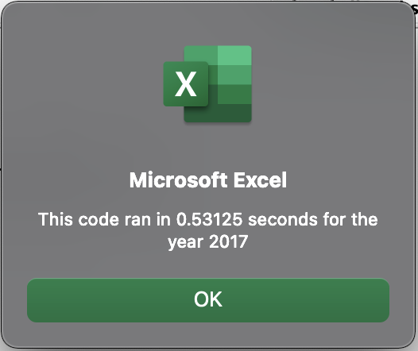
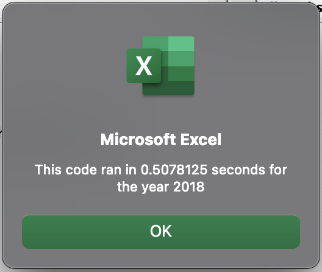
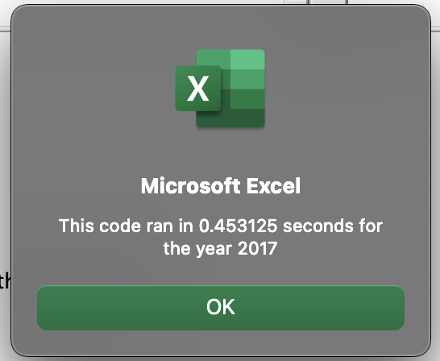
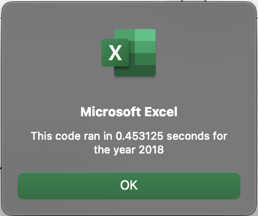

## Overview

### Purpose

Through the use of VBA code, a basic analysis was requested by our client in order to quickly analyze stock information in a stock market dataset and automatically populate and format a summary listed on a separate sheet. VBA was used to provide information on ticker symbols, daily volume, and total return for the year.

Overall, the client was satisifed but wanted to expand the code to include the entire stock market while also keeping the execution run time efficient. The purpose of this analysis is to see what effects refactoring the current VBA code will have on execution time.

### Overview of Source Data

The data obtained for this analysis came from an Excel Workbook titled `green-stocks`. The spreadsheet contained two worksheets titled `2017` & `2018` that listed dates, prices and volumes of select stock tickers.


### Summary of Original Code

In the original code, an array was set up to store the values of the ticker names. A `for loop` was intiated that set a variable named `ticker` to a specific name. 

```vb
 Dim tickers(12) As String
   tickers(0) = "AY"
   tickers(1) = "CSIQ"
   tickers(2) = "DQ"
   tickers(3) = "ENPH"
   tickers(4) = "FSLR"
   tickers(5) = "HASI"
   tickers(6) = "JKS"
   tickers(7) = "RUN"
   tickers(8) = "SEDG"
   tickers(9) = "SPWR"
   tickers(10) = "TERP"
   tickers(11) = "VSLR"

For i = 0 To 11
    ticker = tickers(i)
    totalVolume = 0
```

The loop (ticker loop) and array above is set up so that as *i* progresses through its loop, the `ticker` variable will update as required. A variable named `totalVolume` will also be set to zero at the start of every *i* loop.

A second loop (row loop) is nested inside the ticker loop to cycle through each row and check to see if the value in the first column matches the `ticker` variable. If so, it will add that row's total volume to the `totalVolume` variable. `totalVolume` is a running total that will not reset until *i* proceeds with next loop. The `startingPrice` and `endingPrice` variables are assigned only if the current row is the first or last row containing the ticker set by the *i* value.

```vb
For j = 2 To RowCount
           
    If Cells(j, 1).value = ticker Then

        totalVolume = totalVolume + Cells(j, 8).value

    End If
       
    If Cells(j - 1, 1).value <> ticker And Cells(j, 1).value = ticker Then

        startingPrice = Cells(j, 6).value

    End If


    If Cells(j + 1, 1).value <> ticker And Cells(j, 1).value = ticker Then

        endingPrice = Cells(j, 6).value

    End If

Next j
```

After cycling through all rows with data (limit is set by a `RowCount` variable), the program will input the value for `totalVolume`, and use the `startingPrice` and `endingPrice` to calulate the % return for the year. These values are inserted on the `AllStockAnalysis` sheet.

```vb
Worksheets("AllStocksAnalysis").Activate
    Cells(4 + i, 1).value = ticker
    Cells(4 + i, 2).value = totalVolume
    Cells(4 + i, 3).value = endingPrice / startingPrice - 1
```

With this method, the code needs to assess every row in order to obtain the values needed for just one stock. (`totalVolume`, `startingPrice`, & `endingPrice`). After the values for one stock are obtained and inputted on the `AllStockAnalysis` sheet, the *i* loop will progress and the ticker variable will update to the next in line based on the array. The code will need to assess every row again to obtain the values needed for that ticker.

### Original Execution Times

The following snapshots capture the execution times for the original code.





2017 Original Execution Time: 0.53125 seconds

2018 Original Execution Time: 0.50781 seconds

---


## Results

### Summary of Refactored Code

The previous method required the code to loop through all the rows of the data 12 times in order to obtain the values for all the stocks listed. Through this refactoring exercise, the VBA code was edited to loop through all rows of the data **one** time and be able to collect all the necessary information to provide the `AllStocksAnalysis` sheet with the total daily volume and the % return.

A `tickerindex` variable added and was set to zero and set up three more arrays to store values as the rows are looped through.

```vb
tickerindex = 0

Dim tickervolumes(1 To 12) As Long, tickerstartingprices(1 To 12) As Single, tickerendingprices(1 To 12) As Single
```

In the refactored code, the outer loop is for the rows. The nested loop inside will cycle through the `tickerindex`. This differs from the original code.
In lieu of selecting one ticker and requiring the nested loop to cycle through all the rows before changing tickers, the code will now cycle through all the tickers at each row. This ensures that at least one value is stored from every row. As these values are obtained, it will store the value in the respective array set up for `tickervolumes`, `tickerstartingprices`, and `tickerendingprices`.

```vb
For j = 2 To RowCount
    
    For tickerindex = LBound(tickers) To UBound(tickers)

        If Cells(j, 1).value = tickers(tickerindex) Then
            tickervolumes(tickerindex) = tickervolumes(tickerindex) + Cells(j, 8).value
        End If
                            
        If Cells(j, 1).value = tickers(tickerindex) And Cells(j - 1, 1).value <> tickers(tickerindex) Then
            tickerstartingprices(tickerindex) = Cells(j, 6).value
        End If
                            

        If Cells(j, 1).value = tickers(tickerindex) And Cells(j + 1, 1).value <> tickers(tickerindex) Then
            tickerendingprices(tickerindex) = Cells(j, 6).value
        End If
                            
    Next tickerindex
            
Next j
```

For the code above, the tickerindex loop starting and ending values are tied to the lower bound value(LBound) and upper bound (UBound) values of the tickers array. By referencing the tickers array, the value will start at 1 and cycle to 12. *The LBound and UBound are specifed for the tickindex value instead of integers to allow the array to fluctuate in size and still have the loop compensate and cycle through all of the values. If the tickerindex loop was set with integers, a 13th value added to the tickers array would not be included in the loop since it would stop at 12.*

The updated code now assesses each row against every ticker before moving on to the next row. The same if statements from the original code are used but in this case, the tickerindex is tied to arrays instead of variables. As the tickerindex index is increased, so are the idicies for the `tickervolumes`, `tickerstartingprices`, and `tickerendingprices`. If a value is captured through one of the if statements, it will be stored in the respective array. These values are now called upon and inputted on the AllStocksAnalysis sheet once for the entire code. This happens after all the rows have been looped through. Since every row was tested against each ticker, we can rest assured that all values have been obtained after one loop through the rows. 

```vb
For tickerindex = LBound(tickers) To UBound(tickers)
    
asa.Activate
    Cells(3 + tickerindex, 1).value = tickers(tickerindex)
    Cells(3 + tickerindex, 2).value = tickervolumes(tickerindex)
    Cells(3 + tickerindex, 3).value = tickerendingprices(tickerindex) / tickerstartingprices(tickerindex) - 1
```

### Refactored Execution Times

<<<<<<< HEAD
The following snapshots capture the execution times for the refactored code.
=======
The following snapshots capture the execution times for the original code.
>>>>>>> 930aff8b2add497dd634989c73701846f99ba570





2017 Refactored Execution Time: 0.45313 seconds

2018 Refactored Execution Time: 0.45313 seconds

---

## Summary

### Performance of Refactored Code

The refactored code decreased the execution time by 14.7% for the year 2017 data and by 10.8% for the year 2018 data. 


### Advantages & Disadvantages of Refactoring Code

In addition to helping the code to execute faster, refactoring code has other benefits. The refactoring can identify and reduce the amount of code smells, or parts of code that possibly indicate a deeper issue. Reducing the amount of code smells by refactoring lowers the risk of bugs or failures developing in the future. All this helps to save money associated with the maintenance of the code. With a throughly refactored code, unnecessary language is eliminated or consolidated so that implementing changes and reviewing the code becomes easier. Disadvantages to refactoring include the high cost and time committments that this brings. 

